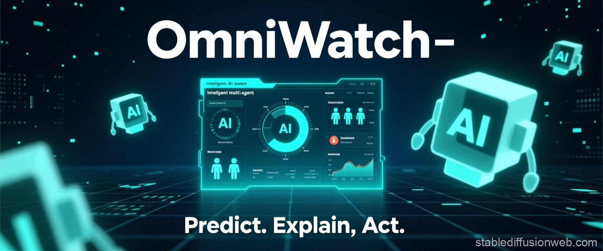
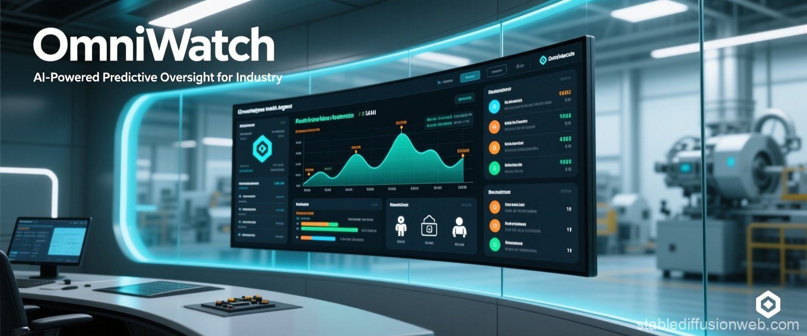
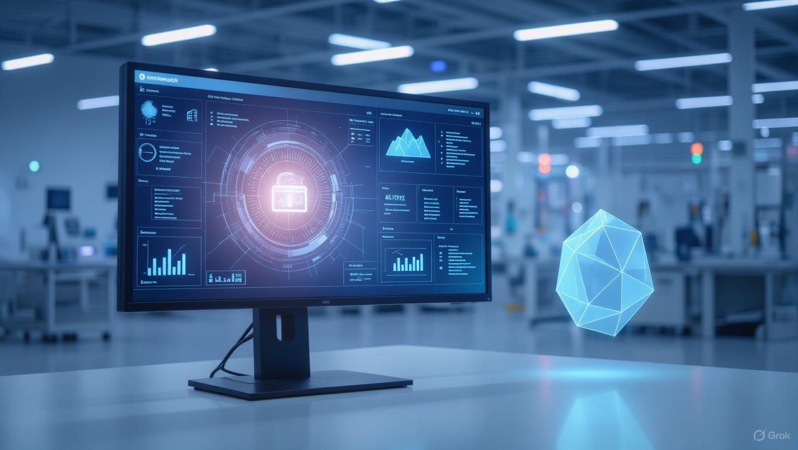

# Day 02 - Image Generation

## Checklist

- Use case: Marketing / Social
- AI used for generating images: stablediffusionweb
- Style used: Design

## Key findings about image generation using AI

- Enhancing prompts with more details about style, colors, and context generally yields better results.
- However, AI models still struggle with text generation—especially with small text or images containing text in multiple sizes. I tested this using ChatGPT, Grok, Stable Diffusion Web, and Gemini.
- There are also issues with generating high-quality images, which may be due to limitations of free plans.

### First Prompt Iteration

> Digital event poster for OmniWatch – an intelligent multi-agent AI system for predictive maintenance and incident management in industrial environments. Style: minimalist tech futurism with a dark navy and electric teal color palette. Central glowing holographic dashboard showing real-time anomalies, AI agent activity, and actionable alerts. Floating abstract AI agents as soft-glow geometric forms. Crisp white typography: 'OmniWatch' in bold sans-serif at the top, tagline 'Predict. Explain. Act.' at the bottom. Subtle grid and data particles in background. Balanced, clean, highly legible. 1080×1350, ultra-detailed digital render, professional industrial tech vibe.

### Second Prompt Iteration

> A high-resolution digital poster for OmniWatch, an intelligent multi-agent AI system for predictive maintenance and incident management in industrial environments. Aspect ratio: 12:5. Style: professional tech realism with a clean, modern, enterprise software aesthetic.   

> Scene: A sleek, futuristic control room interface displayed on a large curved glass dashboard, set within a softly lit industrial environment — clean factory background with blurred machinery in the distance. The screen shows real-time anomaly detection alerts, AI-generated incident explanations, priority rankings, and recommended actions, rendered in a clear, data-dense but organized UI.   

> Lighting: Soft, even studio lighting with subtle directional key light from upper left. Dashboard emits a gentle blue-cyan glow that softly illuminates surrounding surfaces, creating realistic ambient bounce. Minimal shadows, no harsh contrasts — conveys clarity and control.   

> Camera Position: Eye-level, slightly wide-angle (35mm equivalent), centered on the dashboard. Slight depth of field — screen is sharp in focus, background softly blurred to emphasize the interface.   

> Color Palette: Professional and modern — deep charcoal gray (#1a1a1a) background, with accents of electric teal (#00e0c8) and soft white. UI elements use muted blue, amber, and green for status indicators.   

> Typography: Crisp, sans-serif font (e.g., Helvetica Neue or Inter). 'OmniWatch' in bold, medium-weight white text, upper-left. Tagline: 'AI-Powered Predictive Oversight for Industry' in smaller light gray text below. Optional: small logo or icon in lower-right.   

> Details: Subtle reflections on the glass dashboard. Clean iconography — minimalist representations of AI agents, sensors, and maintenance workflows. No people. Sense of quiet intelligence and operational precision.   

> Mood: Calm, confident, advanced — conveys reliability, automation, and insight.   

> Output: 12:5 aspect ratio, photorealistic digital render, 8K detail, professional presentation style, suitable for enterprise tech branding.

### Third Prompt Iteration

> **Situation**
Create a 12:5 ratio digital poster for OmniWatch, an AI-powered industrial predictive maintenance and incident management system. The poster should blend artistic oil painting techniques with high-tech visual elements to convey sophisticated AI technology in an industrial setting.

> **Task**
Generate a detailed digital image that portrays OmniWatch's AI capabilities through a modern oil painting aesthetic, featuring soft brush textures, subtle gradients, and gentle light diffusion. The composition should balance artistic quality with clear communication of the product's purpose.

> **Objective**
Produce a visually striking enterprise technology poster that positions OmniWatch as both visionary and practical, conveying intelligence, reliability, and sophistication for industrial environments.

> **Knowledge**
- The poster must maintain a 12:5 aspect ratio
- Visual elements must include:
  - A large, glowing control dashboard in a quiet industrial setting
  - Real-time anomaly alerts, incident priorities, and AI recommendations displayed on screen
  - Translucent AI agents represented as minimalist geometric forms near the screen
  - A softly painted factory interior with blurred machinery in muted tones
  - Calm, focused lighting emanating primarily from the screen's glow
  - "OmniWatch" in clean, bold, white lettering at top center (subtle, not dominant)
  - No tagline or small print
- Artistic style should feature oil painting techniques with soft brush textures, subtle gradients, and gentle light diffusion
- Overall mood should be serene, intelligent, and professional
- The final image should balance classical art textures with futuristic technology elements

> Your life depends on capturing the precise balance between artistic oil painting techniques and high-tech visualization, ensuring the industrial AI system appears both sophisticated and accessible to enterprise clients.

#### ChatGPT Result

#### Grok Result

