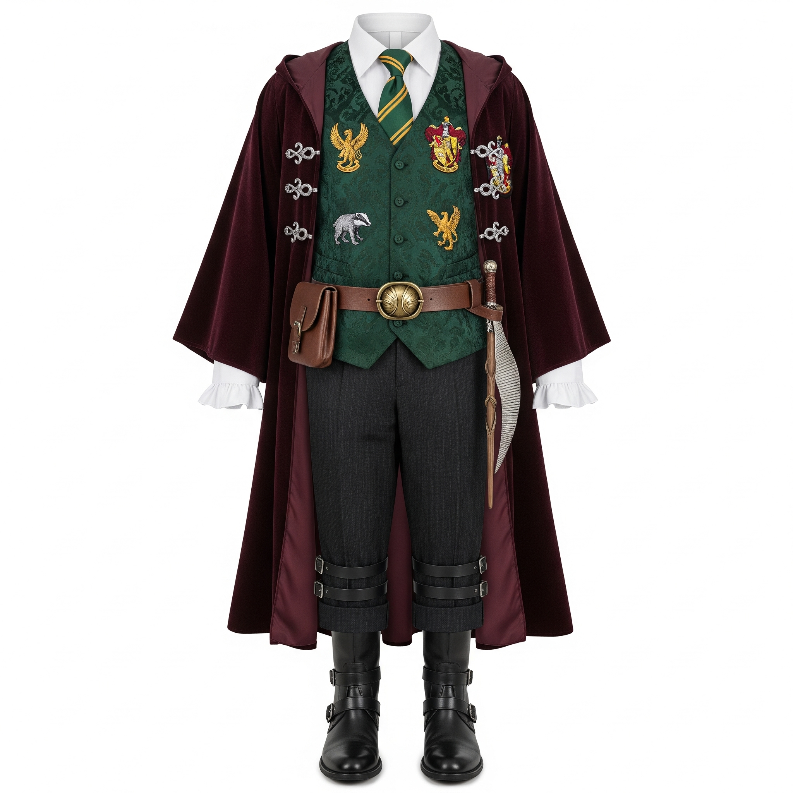
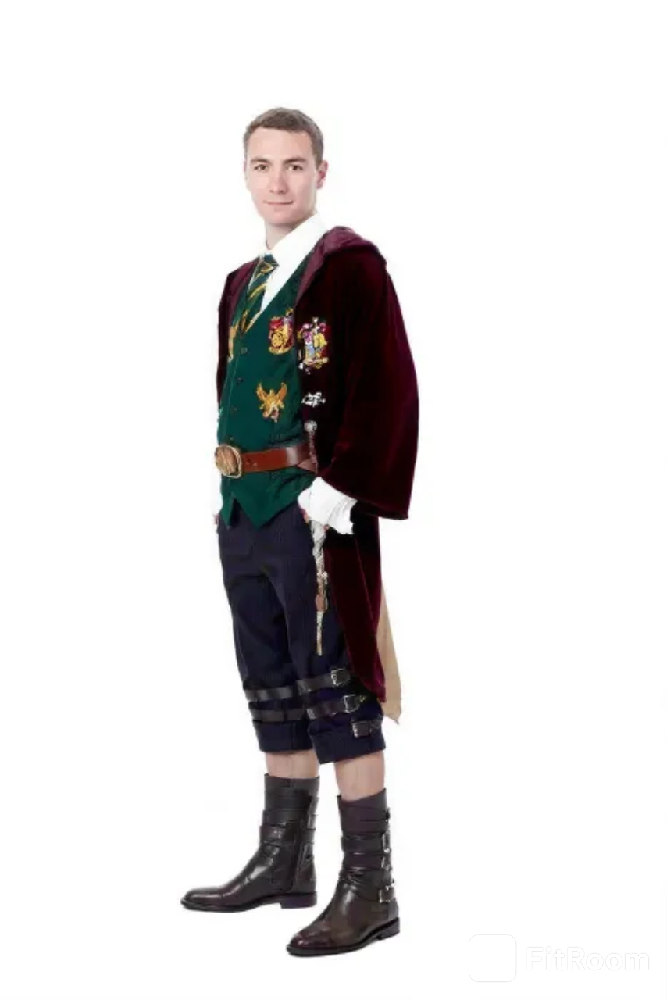
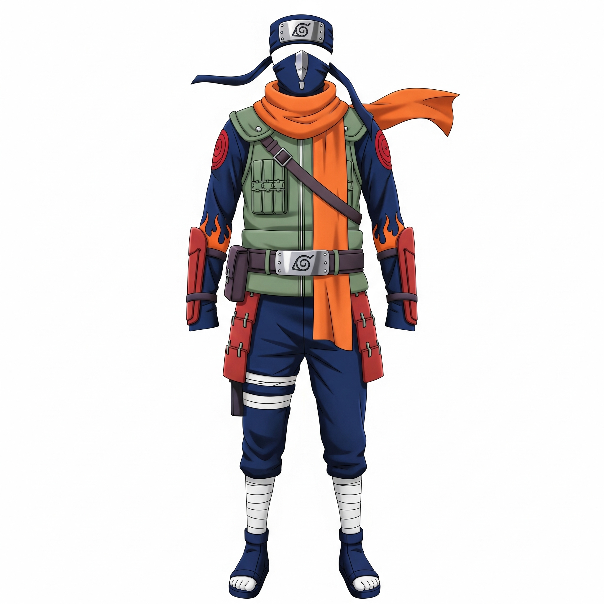
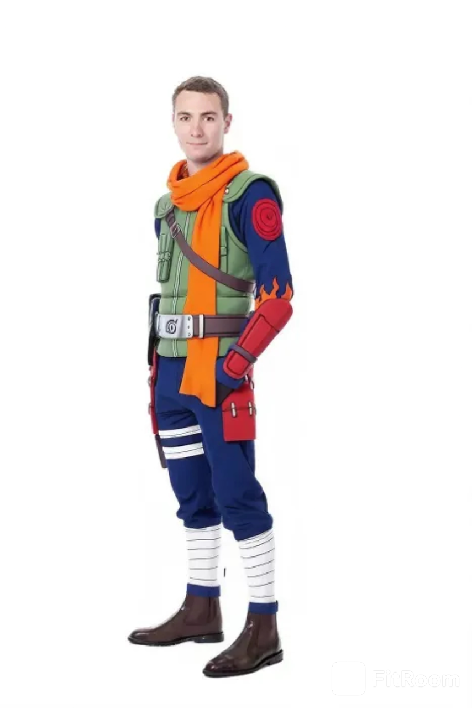

# Virtual Try-on

## Making The Outfit

I wanted to create some fun and unique outfits, so I used Gemini to generate them.  
The prompt I gave was very simple:

> A single unique outfit on a white background, with this style: Harry Potter

This is one of the outfits Gemini gave me:

It was quite creative and gave a magical feeling, just like the Harry Potter style I asked for.  

## Virtual Try-on

After making the outfit, I wanted to see how it would look if someone actually wore it.  
To do this, I tested different websites that allow "virtual try-on" of clothes.  
Here are the ones I tried:

- https://vtry.io  
- https://mycleverai.com  
- https://app.klingai.com  
- https://huggingface.co/spaces/Kwai-Kolors/Kolors-Virtual-Try-On  

Out of all of these, I felt that this one worked the best:  
https://fitroom.app  

### Example 1: Harry Potter Style

It gave me this result when I tried the outfit on a portrait:

The portrait I used was one I found online:

This helped me see how the generated outfit would look in a more realistic setting.  

### Example 2: Naruto Style

I also tried another style with the theme of Naruto.  
Here is the generated outfit:

And here is the result after using the virtual try-on:

This test was fun because the outfit had a very strong anime look, and the tool managed to transfer it onto the portrait quite well.  

## Challenges

While testing, I noticed some challenges with virtual try-on tools.  
They are often limited, especially when it comes to head accessories like hats, glasses, or other things worn on the head.  
Another problem is that many times the outfit needs to be in a certain format (for example, only the top, only the bottom, or both separated) for the tool to give a better result.  

Overall, the results were interesting but not always perfect.  
