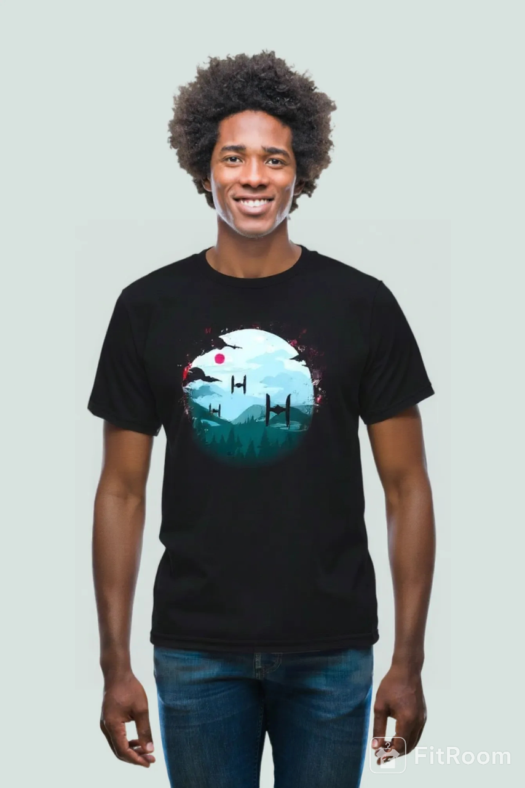

# Virtual Try-On Technology

## What is Virtual Try-On?

Virtual try-on is an innovative technology that allows customers to see how clothing, accessories, or other products will look on them without physically wearing the items. Using AI and computer vision, it creates realistic previews by overlaying products onto photos or live video feeds.

## Key Benefits

- **Enhanced Shopping Experience** - Customers can visualize products before purchasing
- **Reduced Returns** - Better size and style matching leads to fewer returns
- **Increased Confidence** - Shoppers feel more confident in their purchase decisions
- **Accessibility** - Try products from anywhere, anytime

## Example: FitRoom.app

FitRoom.app demonstrates how virtual try-on technology works in practice. As shown in the example images, users can:

1. **Upload a Photo** - Start with a clear photo of yourself
2. **Select Products** - Choose from available clothing items (like the Star Wars themed t-shirt shown)
3. **See the Result** - View how the item looks on you with realistic fitting and positioning
4. **Make Decisions** - Confidently decide whether to purchase based on the virtual preview

*Before: Original photo*

*After: Virtual try-on result showing the Star Wars t-shirt*

The technology accurately maps clothing onto the person's body, maintaining proper proportions and realistic draping to give an authentic preview of how the garment will look when worn.

This technology is revolutionizing online shopping by bridging the gap between digital and physical retail experiences.