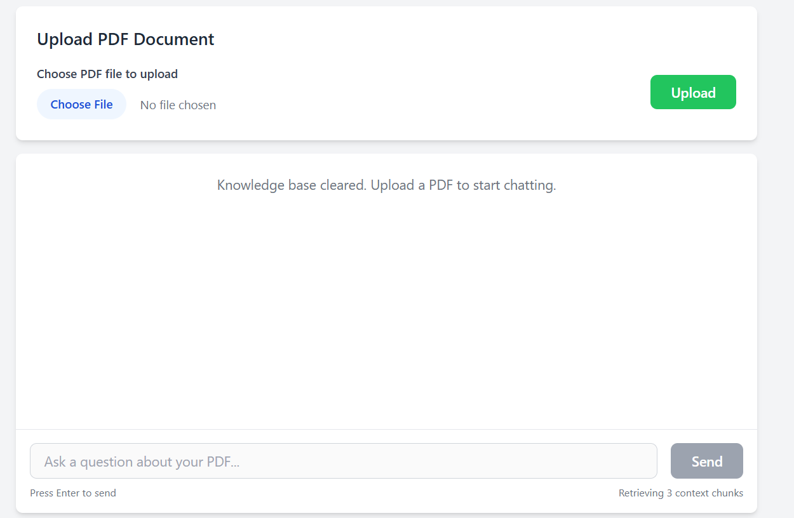

# Simple RAG API with PDF

A FastAPI-based Retrieval-Augmented Generation (RAG) system that processes PDF documents and provides intelligent chat responses using Google Gemini AI and ChromaDB vector storage.

## Features

- **PDF Document Processing**: Upload and process PDF files to create a searchable knowledge base
- **Intelligent Chat**: Ask questions about your uploaded documents
- **Vector Search**: Uses ChromaDB for efficient document retrieval
- **Google Gemini AI**: Powered by Gemini-1.5-flash for response generation
- **RESTful API**: Clean FastAPI endpoints for easy integration
- **Web UI**: Built-in chat interface accessible via browser

## Installation

1. Install dependencies:
```bash
pip install -r requirements.txt
```

2. Set up environment variables:
Create a `.env` file in the project root:
```
GEMINI_API_KEY=your_google_gemini_api_key_here
```

## Usage

### Starting the Server

```bash
python main.py
```

The server will start on `http://localhost:8000`

### API Endpoints

- **GET /** - API information and available endpoints
- **POST /chat** - Chat with the RAG system
- **POST /upload-pdf** - Upload PDF file to knowledge base
- **POST /upload-pdf-from-path** - Load PDF from local file path
- **GET /ui** - Access the web chat interface
- **GET /knowledge-base/info** - Get knowledge base information
- **GET /knowledge-base/summary** - Get document summary
- **DELETE /knowledge-base/clear** - Clear the knowledge base
- **GET /health** - Health check endpoint

### Web Interface

Access the chat UI at: `http://localhost:8000/ui`

### API Documentation

Interactive API docs available at: `http://localhost:8000/docs`

## Screenshots

### Initial Upload Interface


The initial interface presents a clean, user-friendly upload area where users can:
- Select PDF files using the "Choose File" button
- Upload documents with the green "Upload" button
- See the current knowledge base status (empty state shown)
- Access the chat input field (disabled until document is uploaded)

### Document Processing & Chat


After uploading a PDF document, the interface shows:
- **Success confirmation**: "Successfully uploaded and processed 10 day challenge with AI Crafters.pdf (18 pages)"
- **Clear KB button**: Red button to clear the knowledge base when needed
- **AI Response**: Intelligent analysis of the document content, identifying it as a community event by AI Crafters in 2025
- **Active chat interface**: Users can now ask questions about the uploaded PDF
- **Context tracking**: Shows "Used 3 context chunks" indicating the RAG system's retrieval process

The system demonstrates its ability to understand document content and provide meaningful responses about the uploaded materials.

## Project Structure

- `main.py` - FastAPI application and API routes
- `rag_service.py` - RAG system implementation
- `config.py` - Configuration settings
- `database.py` - Database utilities
- `chat.html` - Web chat interface
- `requirements.txt` - Python dependencies
- `chroma_db/` - ChromaDB vector database storage

## Dependencies

- FastAPI - Web framework
- ChromaDB - Vector database
- LangChain - Document processing and AI integration
- Google Generative AI - Language model
- PyPDF - PDF document parsing
- Uvicorn - ASGI server